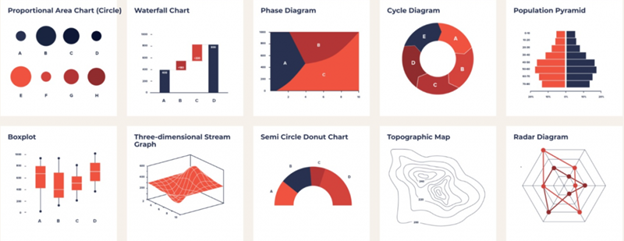

# Data Analysis Methods

Parametric Tests (e.g., t-Tests, ANOVA)
Non-Parametric Tests (e.g., Mann-Whitney U, Kruskal-Wallis)
Tests for Categorical Data (e.g., Chi-Square, Fisher’s Exact)
Correlation and Association Tests (e.g., Pearson, Spearman)
Regression Analysis (e.g., Linear, Logistic)
Tests for Variance (e.g., Levene’s, F-Test)
Normality Tests (e.g., Shapiro-Wilk, Anderson-Darling)

# Project Overview

This project includes an exploratory data analysis (EDA) phase.

## EDA Chart

## 1. Parametric Tests
These assume underlying statistical distributions (usually normal distribution).
- **a. t-Tests**
One-sample t-test: Compares the sample mean to a known value.
Independent two-sample t-test: Compares means of two independent groups.
Paired t-test: Compares means from the same group at different times.
- **b. ANOVA (Analysis of Variance)**
One-way ANOVA: Compares means across 3 or more independent groups.
Two-way ANOVA: Examines the effect of two categorical independent variables on a continuous outcome.
- **c. Z-Test**
Similar to t-test but used when population variance is known and sample size is large.

## 2. Non-Parametric Tests
Used when data doesn’t meet parametric assumptions (e.g., not normally distributed).
- **a. Mann-Whitney U Test**
Non-parametric alternative to the independent t-test.
- **b. Wilcoxon Signed-Rank Test**
Non-parametric alternative to the paired t-test.
- **c. Kruskal-Wallis Test**
Non-parametric version of one-way ANOVA.
d. Friedman Test
Non-parametric version of repeated measures ANOVA.

## 3. Tests for Categorical Data
- **a. Chi-Square Test**
Goodness-of-fit: Tests if sample distribution fits a population.
Test of independence: Tests if two categorical variables are related.
- **b. Fisher’s Exact Test**
Used instead of Chi-square when sample sizes are small.

## 4. Correlation and Association Tests
- **a. Pearson Correlation**
Measures linear correlation between two continuous variables.
- **b. Spearman’s Rank Correlation**
Non-parametric measure of rank correlation.
- **c. Kendall’s Tau**
Another non-parametric correlation coefficient.

## 5. Regression Analysis
- **a. Linear Regression**
Models relationship between a dependent variable and one or more independent variables.
- **b. Logistic Regression**
Used when the dependent variable is binary.

## 6. Tests for Variance
- **a. Levene’s Test**
Tests equality of variances across groups.
- **b. Bartlett’s Test**
Similar to Levene’s but assumes normality.
- **c. F-Test**
Compares two variances.

## 7. Advanced and Specialized Tests
- **a. Shapiro-Wilk Test**
Tests for normality.
- **b. Kolmogorov-Smirnov Test**
Compares a sample with a reference probability distribution.
- **c. Anderson-Darling Test**
A more sensitive test for normality.

## 1. Parametric Tests

## 2. Non-Parametric Tests

## 3. Tests for Categorical Data

## 4. Correlation and Association Tests

## 5. Regression Analysis

## 6. Tests for Variance

## 7. Advanced and Specialized Tests

Data Analysis Methods
## 1. Descriptive Statistics
Descriptive statistics is a branch of statistics, which aims to provide an intuitive understanding of data by summarizing and summarizing the main features of a data set. This analysis method focuses on basic statistical characteristics such as the central tendency, dispersion and distribution shape of the data.
Descriptive statistics usually present data in the following aspects:
- Central location measurement describes the central tendency of the data. Commonly used statistics include mean (average), median and mode.
- Dispersion measurement: measures the dispersion or dispersion of data and reflects the fluctuation of data. Common statistics include standard deviation, variance, range, etc.
- Data distribution: describes the distribution shape of data and summarizes the overall structure of the data set. Including normal distribution, skewed distribution, kurtosis, etc.
- Frequency and frequency: count the number of times each value or range appears in the data set, and its proportion in the whole.
- Descriptive charts: use visual means such as histograms, box plots, scatter plots, etc. to show the distribution and rules of data, making it easier for people to understand data.
## 2. Exploratory Data Analysis (EDA)
Exploratory data analysis is a data analysis method proposed by statistician John W. Tukey. It aims to deeply understand the structure, characteristics and patterns of data sets through drawing and statistical means, discover potential trends and anomalies, and provide a basis for subsequent in-depth analysis and modeling. The goal of EDA is not to conduct strict inferential statistics, but to conduct preliminary, intuitive and comprehensive exploration of data.

The main features of EDA include:
- Visual data: By drawing visual charts such as histograms, scatter plots, box plots, etc., the distribution, relationship and form of data are displayed in an intuitive way.
- Statistical description: Use statistical descriptive statistics such as mean, median, standard deviation, etc. to describe the central tendency and dispersion of data.
- Correlation analysis: By calculating the correlation coefficient between variables or drawing a correlation matrix, the relationship between variables is revealed.
- Distribution morphology analysis: Determine the distribution morphology of data, including normality, skewness and kurtosis, to provide a reference for selecting appropriate statistical methods for subsequent modeling.
## 3. Hypothesis Testing and Inferential Statistics
Inferential statistics is a branch of statistics that focuses on obtaining information about the population from a sample. It helps us understand the nature of the population, make predictions, or infer population parameters by analyzing and inferring sample statistics.

Inferential statistics mainly includes two aspects:

## 1) Parameter estimation: using sample data to estimate the value of the population parameter, including point estimation and interval estimation. Point estimation gives a single value as an estimate of the population parameter, while interval estimation provides an interval of parameter estimation, indicating our uncertainty about the population parameter.

## 2) Hypothesis testing: Hypothesis testing is a common method in statistics used to test a hypothesis about a population parameter. This method is based on sample data and evaluates whether the null hypothesis can be rejected by comparing the difference between the observed statistical value and the theoretical expected value under the null hypothesis. Hypothesis testing usually includes the following steps:

- Establishing a hypothesis: Propose a null hypothesis (H0) and an alternative hypothesis (H1) about the population parameter.

- Selecting a significance level: Determine the significance level (usually 0.05), indicating that at this level, if the observed difference is large enough, the null hypothesis is rejected.
- Collect sample data: Draw a sample from the population and calculate the sample statistic.
- Calculate the test statistic: Calculate a test statistic based on the sample data, the distribution of which is known under the condition that the null hypothesis is true.
- Make a decision: Compare the calculated test statistic with the significance level. If it is less than the significance level, reject the null hypothesis; otherwise, accept the null hypothesis.
## 4. Regression analysis
Regression analysis is a statistical method used to study the relationship between independent variables and dependent variables. By establishing a mathematical model, regression analysis aims to reveal how changes in independent variables affect changes in dependent variables, as well as the extent and direction of this influence.

Regression analysis can be divided into two categories:
- Simple linear regression: regression analysis when there is only one independent variable. The regression equation is Y = β₀ + β₁X₁ + ε.
- Multiple linear regression: regression analysis when there are multiple independent variables. The regression equation is Y = β₀ + β₁X₁ + β₂X₂ + ... + ε.
## 5. Cluster analysis
Cluster analysis is an unsupervised learning method that aims to divide observations in a data set into similar groups, which are called clusters. The goal of clustering is to make observations within the same cluster more similar, while observations between different clusters are less similar. Through clustering, we can discover the inherent structure in the data, identify patterns, and divide similar observations into the same group, which helps to deeply understand the data.

Cluster analysis is widely used in many fields, such as:
- Market analysis: Segment the market based on consumer behavior to better understand the target market.
- Biology: Cluster gene expression data into gene groups with similar functions.
- Image analysis: Cluster similar images together for image retrieval and classification.
- Social network analysis: Group users in a social network according to their behavior patterns.
## 6. Correlation analysis
Correlation analysis aims to discover the associations between different items in a data set. These association rules describe the patterns that occur in an event or set, indicating that given some conditions, other conditions may also occur. Common applications include shopping basket analysis, cross-selling, network traffic analysis, etc.

In correlation analysis, there are two key indicators:
- Support: measures the frequency of a rule in a data set. A high support indicates that the rule appears more frequently in the data set.
- Confidence: measures the credibility of the rule, that is, the probability that the result will appear when the condition occurs. A high confidence indicates that the rule is more reliable.
Classic algorithms for correlation analysis include:
- Apriori algorithm: based on the prior principle, gradually generates association rules from frequent item sets (a set of items that frequently appear in a data set).
- FP-growth algorithm: uses a data structure called "frequent pattern tree" to recursively decompose the data set to find frequent item sets.
Correlation analysis has been widely used in business and science. For example, in the retail industry, by analyzing customers' shopping baskets, merchants can develop more effective promotion strategies; in medical research, correlation analysis can help discover patterns of illness or side effects of drugs, etc.
## 7. Time series analysis
Time series analysis is a statistical method for studying data that changes over time. A time series is a series of data points arranged in chronological order, usually observations collected at equal intervals. These data points can be used to analyze trends, periodicity, seasonality, and other possible patterns over time.

Time series analysis mainly includes the following aspects:
- Trend analysis: Identify and describe long-term trends in the data to determine whether the data is gradually increasing, decreasing, or remaining stable.
- Seasonality analysis: Explore whether there are patterns in the data that repeat according to the season. Seasonality analysis helps to understand the cyclical fluctuations of data within a year.
- Cyclic analysis: Similar to seasonality, cyclical analysis focuses on long-term recurring patterns, but the cycle of these patterns may not be a fixed year.
- Noise analysis: Examine random fluctuations in time series to determine whether there are unpredictable random changes.
- Forecasting and model building: Based on existing time series data, mathematical models are established to predict future observations.
Time series analysis has applications in many fields, including finance, economics, meteorology, ecology, medicine, etc. By deeply understanding the patterns of time series, people can better predict future trends, make decisions, and plan.
## 8. Spatial Data Analysis
Spatial data analysis is a method that focuses on processing and analyzing data related to geographic locations. This type of data includes geographic information, geographic coordinates, topography, etc., and is usually based on spatial objects and their locations on the earth's surface. The goal of spatial data analysis is to reveal patterns, trends, and associations in geographic space, thereby helping us better understand geographic phenomena, make decisions, and plan.

The main contents of spatial data analysis include:
- Geographic Information System (GIS): GIS is a tool that integrates spatial data analysis and spatial data visualization. It allows users to collect, store, analyze, and display geospatial data, supporting map making and decision making.
- Geostatistics: Geostatistics focuses on statistical analysis of phenomena in geographic space, including spatial interpolation and variogram analysis.
- Geographic Data Mining: Similar to traditional data mining, geographic data mining focuses on discovering hidden patterns and knowledge from spatial data.
- Spatial model: Use statistical and machine learning methods to establish prediction and classification models for spatial data, such as spatial regression models, Geographically Weighted Regression (GWR), etc.
- Network analysis: Study the paths, connections and network relationships in spatial networks, which are usually used in transportation planning, telecommunications networks and other fields.
- Remote sensing analysis: Use remote sensing technology to obtain information on the earth's surface, and analyze remote sensing images to understand surface characteristics, coverage types and changes.
## 9. Survival analysis
Survival analysis is a statistical method used to study the probability and time relationship of a specific event (such as death, disease recurrence, equipment failure, etc.) occurring in an individual or object over a period of time. It takes into account the censoring situation in the data, that is, the observed survival time may not reach the endpoint event or be lost.

The main contents of survival analysis include:
- Survival Function: Describes the probability of an individual or object surviving within a given time.
- Survival Curve: A curve drawn with time as the horizontal axis and survival function as the vertical axis, which is used to intuitively display the survival probability of individuals or objects at different time points.
- Censoring: Some observations in the survival data may be censored because they did not reach the endpoint event. Survival analysis should consider how to deal with such censored data.
- Hazard Ratio: It is used to compare the risk differences in survival time between different groups or treatments and is an important indicator of survival analysis.
- Cumulative Hazard: It describes the cumulative probability of experiencing an endpoint event before a given time point.
- Survival analysis model: It includes semi-parametric models (such as Cox proportional hazard model) and parametric models (such as exponential distribution, Weibull distribution, etc.), which are used to estimate the survival function and compare the impact of different factors on survival time.
Survival analysis is widely used in medicine, biology, epidemiology, engineering and other fields to evaluate treatment effects, disease prognosis, product life, quality control and other issues.
## 10. Reliability Analysis
Reliability Analysis is a statistical method used to evaluate the reliability of measurement tools (such as questionnaires, tests, observation scales, etc.), that is, the degree to which the measurement tools produce similar results under different circumstances. Reliability analysis aims to determine the stability and consistency of measurement tools to ensure the accuracy and reliability of measurement results.

In reliability analysis, commonly used statistical indicators include:
- Internal consistency reliability: evaluates the degree of consistency between indicators in the measurement tool. Commonly used statistical indicators include Cronbach's alpha coefficient and Kuder-Richardson coefficient.
- Test-retest reliability: evaluates the consistency of the measurement results of the same measurement tool at different times or under different conditions. It is usually measured using correlation coefficients (such as Pearson correlation coefficient or Spearman correlation coefficient).
- Intra-observer reliability: evaluates the consistency of different observers or raters in evaluating the same object. Commonly used statistical indicators include Kappa coefficient and Intraclass Correlation Coefficient (ICC).
The results of reliability analysis can help researchers determine the credibility and stability of measurement tools, so as to effectively evaluate and interpret research results.
Spatial data analysis is widely used in a wide range of fields, including urban planning, environmental science, agriculture, epidemiology, astronomy, etc. These analyses not only help to understand geographical phenomena, but also provide scientific support for the management and use of geographic information.
## 11. Factor Analysis
Factor analysis is a statistical method used to analyze the potential structure or potential factors between observed variables. It aims to identify the commonalities between multiple observed variables, summarize them into a smaller number of potential factors, and explore the relationship between these factors and the original variables. Factor analysis is often used in data dimensionality reduction, variable screening, construction of scales or measurement tools, discovery of potential structures, etc.

In factor analysis, the following steps are mainly included:
- Extracting factors: Extracting potential common factors in the data through statistical methods. Commonly used extraction methods include principal component analysis (PCA), maximum likelihood estimation, minimum residual method, etc.
- Rotating factors: Rotating the extracted factors to make the factor structure easier to interpret. Common rotation methods include orthogonal rotation (such as Varimax rotation) and oblique rotation (such as Promax rotation).
- Factor interpretation: Explain the meaning of each factor and link them to the original variables to understand the underlying structure.
- Factor score calculation: Calculate the score of each observed sample on each factor based on the factor loading for further analysis.
Factor analysis is applicable to many fields, including psychology, education, market research, medical research, etc. It can be used to explore the potential relationship between variables, build latent variable models, simplify data structures, etc.

## 12. Principal Component Analysis
Principal Component Analysis (PCA) is a commonly used multivariate data dimensionality reduction technique that aims to convert high-dimensional data into low-dimensional data while retaining the information of the original data as much as possible. It achieves data dimensionality reduction by finding the principal components in the data and projecting the data into a new coordinate system.

The main steps of principal component analysis include:
- Data standardization: Standardize the original data so that each variable has the same scale to avoid inaccurate principal components due to scale differences.
- Calculate the covariance matrix: Calculate the covariance matrix between the standardized variables, which reflects the linear relationship between the variables.
- Eigenvalue decomposition: Perform eigenvalue decomposition on the covariance matrix to obtain the eigenvalue and the corresponding eigenvector. The eigenvector is the direction of the principal component, and the eigenvalue indicates the variance of the data in the direction of the corresponding principal component.
- Select principal components: Select the number of principal components to be retained based on the size of the eigenvalue. Usually, the first few principal components with larger eigenvalues are selected to retain most of the variance information of the data.
- Calculate the principal component score: Project the original data onto the selected principal component to obtain the score of each sample on the principal component as the data after dimensionality reduction.
Principal component analysis can be used for tasks such as data visualization, feature extraction, data compression, and removal of collinearity. It is widely used in many fields, such as finance, biology, medicine, and social sciences.

## 13. Decision Tree Analysis
Decision tree analysis is a tree-structured machine learning algorithm used to build classification or regression models. In a decision tree, each internal node represents a feature/attribute, each branch represents a possible value of the feature, and each leaf node represents a category label or numerical output.

The main steps of decision tree analysis include:
- Feature selection: Select the best features from all possible features to split the data set into different subsets. Commonly used feature selection methods include information gain, Gini index, etc.
- Tree construction: Recursively divide the data set into subsets until the data in the subsets belong to the same category or a predefined stopping condition is reached. The construction process creates nodes by selecting the best features and splits at each node until the stopping condition is met.
- Pruning: To prevent overfitting, the generated decision tree can be pruned to remove some unnecessary nodes and branches, thereby improving the generalization ability of the model.
- Prediction: Use the generated decision tree to classify or regress new samples. According to the feature value of the sample, it goes down along the branch of the tree step by step until it reaches the leaf node, and then the category or value to which the leaf node belongs is used as the prediction result.
Decision tree analysis is easy to understand and highly interpretable. It can handle classification and regression problems and has low data preparation requirements. It is widely used in risk assessment, disease diagnosis, product recommendation and other tasks in the fields of finance, medicine, and industry.

## 14. ROC analysis
ROC (Receiver Operating Characteristic) analysis is a method for evaluating the performance of classification models. It shows the relationship between the true positive rate (also known as sensitivity) and the false positive rate (False Positive Rate) of the classifier by drawing the ROC curve. The horizontal axis of the ROC curve is the false positive rate (FPR), and the vertical axis is the true positive rate (TPR). The curves drawn at different thresholds can help us understand the performance of the classifier under different conditions.

In the ROC curve, we want the true positive rate to be as high as possible and the false positive rate to be as low as possible. Therefore, the closer the ROC curve is to the upper left corner (0,1), the better the classifier performance is. The diagonal line (45° straight line) represents the performance level of random guessing.

In addition to drawing the ROC curve, we can also use the AUC (Area Under the ROC Curve) indicator to measure the performance of the classifier. The AUC value represents the area under the ROC curve, usually between 0 and 1. The closer it is to 1, the better the classifier performance is, and the closer it is to 0.5, the worse the performance is (no different from random guessing).

ROC analysis is often used to compare the performance of different models, select the best classifier, optimize the model threshold, etc. It has a wide range of applications in medical diagnosis, credit scoring, advertising click prediction and other fields.

## 15. Discriminant Analysis
Discriminant Analysis is a statistical analysis method that aims to distinguish or classify the differences between two or more known groups. Its main purpose is to determine the relationship between multiple variables (also called predictor variables) and one or more categorical variables (also called response variables or dependent variables) by analyzing these variables and making classifications or predictions based on these relationships.

Discriminant analysis is often used in the following situations:
- The data contains one or more continuous variables, as well as a discrete categorical variable.
- Predict unknown categorical labels from known variables.
- Distinguish between two or more groups and determine which variables are most effective in distinguishing these groups.
The main goal of discriminant analysis is to find one or more linear combinations of functions that can best distinguish the differences between different groups. In practice, discriminant analysis usually produces a discriminant function that can be used to classify new observations to determine which group they belong to.
There are several different types of discriminant analysis, including linear discriminant analysis (LDA), quadratic discriminant analysis (QDA), and other variants. The choice of these methods depends on the nature of the data, the degree to which the assumptions are met, and the specific purpose of the analysis.

## 16. Contingency Table Analysis
Contingency Table Analysis is a statistical method used to study the relationship between two or more categorical variables. It organizes data into a two-dimensional table, called a contingency table or cross table, where rows represent the levels of one categorical variable and columns represent the levels of another categorical variable. Each cell in the contingency table represents the frequency or percentage of two categorical variables at a specific level combination.

The main purpose of contingency table analysis is to explore and describe the correlation or association between two or more categorical variables. It can help us answer questions such as:
- Is there an association or correlation between two categorical variables?
- What is the degree of association between different levels of categorical variables?
- What is the effect of the level of one categorical variable on the level of another categorical variable?
In contingency table analysis, commonly used statistical methods include the Chi-square test, which is used to test whether there is a significant association between two categorical variables; residual analysis, which is used to determine the degree of difference between the observed frequency and the expected frequency of each cell in the contingency table; and effect size indicators in the contingency table, such as Cramer's V, which are used to describe the strength of the association between two categorical variables.
Contingency table analysis is often used in social sciences, medicine, market research and other fields to help researchers understand and explain the relationship between different categorical variables, so as to conduct more in-depth data interpretation and decision making.

## 17. Correspondence Analysis
Correspondence Analysis is a multivariate statistical technique used to explore the relationship between categorical data. It is mainly used to analyze the frequency distribution or mutual correlation between two or more categorical variables. The main goal of correspondence analysis is to show the relationship between categorical variables on a two-dimensional graph for easy visualization and interpretation.

The general steps of correspondence analysis include:
- Construct a frequency table: First, construct a frequency table based on the research object or problem to record the frequency or proportion of different categorical variables.
- Calculate the expected frequency: Calculate the expected frequency based on the frequency table, that is, the expected frequency of each cell under the assumption that each categorical variable is independent.
- Calculate the residual: Compare the observed frequency with the expected frequency and calculate the residual to measure the deviation between the observed frequency and the expected frequency.
- Perform correspondence analysis: By performing mathematical methods such as singular value decomposition on the residual, multidimensional data is mapped to a low-dimensional space to obtain the relationship between categorical variables.
The results of correspondence analysis are usually presented in the form of a correspondence plot, in which the levels or categories of different categorical variables are represented by points on a two-dimensional plane, and the position and relative position of the points reflect the relationship between them.
Correspondence analysis has a wide range of applications in market research, social science surveys, ecology, biostatistics and other fields. It can help researchers discover the correlation between variables, identify patterns and structures in the data, and provide useful references for subsequent analysis and interpretation.
